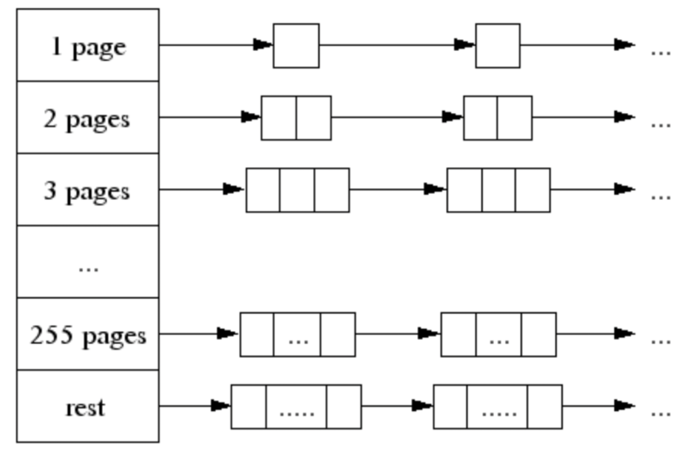

# Go内存-TCMalloc

> 2021-05-02

## 背景
学习Go内存分配的时候，看到Go的内存分配器是基于TCMalloc的，顺路去看一下。

论文地址：http://goog-perftools.sourceforge.net/doc/tcmalloc.html

TCMalloc（Thread-Caching Malloc），顾名思义就是基于线程来分配内存。

核心思想是给每个thread分配一个本地缓存，基于本地缓存的内存分配不存在线程之间的竞争，可以减少锁消耗。

## 名词解释

**Thread-local cache**: 给每个thread分配的本地缓存

**Page**：页，TCMalloc中整个堆由页组成，每个页大小为4KB

**Span**：一行（a run of）连续的页，可以是被分配的（allocated）或者空闲的（free），是页堆链表里的节点（entry）

**小对象**：size <= 32KB

**大对象**：size > 32KB

**Object**：页分割成的不同大小

**Size_class**：可以理解为object的类型，每种size_class有对应的object大小，页会根据size_class进行分割。

## Span

**定义**：一行（a run of）连续的页，可以是被分配的（allocated）或者空闲的（free），是页堆链表里的节点（entry）。

如果一个span被分配了，它可以被分配给一个大对象，或者分割成小的objects。

每个page都有所属的span，如下图，上面的小块表示page，a,b,c,d是span。

可以用一个 central array 来标记每个page所属的span。central array 以 page 数为索引。每个页指向一个span地址。

举例：

> 如果系统中的一个地址大小为32bit，每个page大小为4KB。
>
> 在central array中，一个4KB大小的 page 可以用 32bit 标记。
>
> 32位系统的最大寻址空间为4GB（2^32），对于 4GB大小 的 heap，有 4GB / 4KB 个页。
>
> 也就是说 central array 需要 4GB / 4KB * 32 bit = 4MB 大小。

对于64位系统，一般使用 3-level radix tree（没了解），而不是 central array

## 小对象分配

先介绍一下 size_class，论文里提到大约有170个size_class（goland里有67个，这个是写死的）。

每个 size_class 对应一个 object 大小

小对象们在分配时会根据自己的size找到最合适的size_class，进而找到 objects 进行分配。

举例

> 如果size_class_1 对应的大小为 8B，size_class_2 对应的大小为16B（这个对应关系是全局固定的）
>
> 如果有一个小对象大小为 12B，那么这个小对象对应的就是 size_class_2。
>
> 每个 span 会有一个 size_class，span会按照 size_class 对应的 object 大小进行分割，成为固定大小的objects。

小对象的分配在 thread-local cache 进行。

每个 thread-local cache 维护一个 linked list，其中为每个 size_class 维护一个 objects 的空闲链表。

如下图，图中的 class 就是 size_class，每个 size_class 链表里的 object 大小都是相等的。

小对象分配过程：

1. 根据小对象的大小，找到对应的 size_class
2. 找到当前线程的 thread-local cache，从对应 size_class 的空闲链表里找到空闲的 object。
3. 如果空闲链表里有 object，会返回链表第一项，并将其从空闲链表中删除
4. 如果空闲链表非空，需要先从上层 central free list 获取到对应 size_class 的 objects
    1. central free list 的结构可以认为是和 thread-local cache 一样，都是为每个 size_class 维护一个 objects 的空闲链表
    2. 从 central free list 获取的 objects 放入 thread-local cache 后，返回链表第一项。
    3. 如果 central free list 的空间也不足，会向 heap 获取 span，进行分割后放入 central free list。

**Tips**
> 第 3 步不需要上锁，因为thread-local cache 只被当前线程占用。
>
> 第 4 步需要上锁，因为 central free list 是所有线程公用的。

## 大对象分配

大对象用 central page heap 进行分配，central page heap的结构与之前介绍的 thread-local cahe 差不多，也是空闲链表构成的数组。如下图所示，图中的每个小白框表示一个 page。

大对象分配过程：

1. 先按照对象大小计算需要多少page（每个page 4K），然后去对应的链表里找空闲空间。
2. 对于需要 >= 256 个页的对象，统一用 rest 分配。
3. 如果需要分配的链表（假设 k）为空，即没有可分配的空间，就去找下一个链表（k + 1），再下一个。。。
4. 如果在某个链表里找到了（k + n），会将多余的 n 个页插入到合适的链表位置。
5. 如果找到rest依然空间不足，需要向系统申请资源。

## 对象回收

当一个对象被回收时，先通过这个对象的 page 找到对应的 span。

span 有两种可能，一个是分配给大对象，一个是分配给小对象

1. 如果分配给小对象，就把回收的空间插入到合适的 thread-local cache 里

2. 如果分配给大对象，span 会告知当前被回收对象所占据的 page 范围（例如 [p, q]），这个范围的page会被完全回收。同时，还会去查询附近的 p-1 和 q + 1 page，如果附近的 page 也是空的，会进行合并，一起放入 heap。

## thread-local cache 回收

thread-local cahe 大小超过 2MB 时，会进行垃圾回收（GC）。

当线程数量增加时，阈值（2MB）会降低，这是为了在很多线程的情况下，不浪费大量内存。

每次 GC 从 thread-local cache 的空闲链表里回收 “一部分” 到 central free list。

回收时，每个空闲链表的回收objects数量由参数 L 决定。下面先定义一下 L：

> L 是自上次垃圾回收后，空闲链表的最小长度。
>
> 说明在上一次垃圾回收时，即使剩余空闲链表缩小 L，在上一次垃圾回收到本次回收期间，并不会触发向central free list 请求资源。

可以将 L 作为对未来的预测，每次将 L/2 的 objects 回收到 central free list 中。

## central free list 回收

之前提到过，central free list 的结构可以认为是和 thread-local cache 一样，都是为每个 size_class 维护一个 objects 的空闲链表。

而每个 size_class 对应的 span，可以被分割的 objects 数量是固定的。

回收时，如果 central free list 里，某个size_class对应的空闲链表长度等于这个 span 对应的 objects 数量，说明这个 span 是完全空闲的，可以将它回收到 heap。

