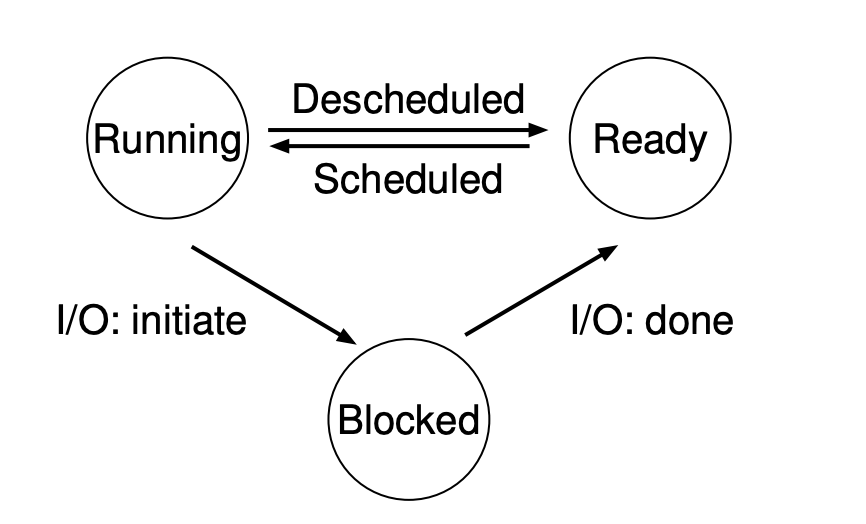

# Virtualization \| Process

> 2021.09.15 \| 《Operating Systems: Three Easy Pieces》- 2

进程是操作系统对正在运行的程序提供的抽象。

## 进程API

* **Create**
* **Destory**
* **Wait**: 停止执行，等待一些交互
* **Miscellaneous Control**: 除终止或wait以外的其他控制方式，例如暂停
* **Status**: 查询进程的一些状态，例如运行时间

## Process Creation

1. **OS** 要做的第一件事是将进程的 **code和静态数据** 从 **disk** 加载到 **memory** 里。

> 早期的操作系统会一次性加载所有 **code和静态数据** ，现在的操作系统会在需要的时候加载需要的部分。

2. 初始化 **run-time stack**

3. **I/O** 相关的一些初始化过程

## Process States

1. Running: 正在处理器上运行指令。

2. Ready: 进程准备好运行了，但是 **OS** 没有选择运行该进程。

3. Blocked: 阻塞等待一些事件发生，例如等待 I/O。

**状态流转**



## 调用方法

### fork()

创建子进程。

> 子进程拥有自己的 address space, register, pc
> 
> 子进程从父进程fork()之后的代码开始运行
>
> 父进程通过fork()获得子进程的PID，子进程在fork()行获得 0

例子：

```
#include <unistd.h>
#include <stdio.h>
#include <stdlib.h>

int main(int argc, char *argv[]) {
    printf("hello world (pid: %d)\n", (int)getpid());
    int rc = fork();
    if (rc < 0) {
        // fork failed
        fprintf(stderr, "fork failed\n");
        exit(1);
    } else if (rc == 0) {
        // child (new process)
        printf("hello, I am child (pid:%d)\n", (int)getpid());
    } else {
        // parent goes down this path (main)
        printf("hello, I am parent of %d (pid:%d)\n", 
            rc, (int)getpid());
    }
    return 0;
}
```

运行结果

```
hello world (pid: 56464)
hello, I am parent of 56465 (pid:56464)
hello, I am child (pid:56465)
```

### wait()

父进程等待子进程完成，并返回子进程的PID

稍微修改一下上面的代码：

```
#include <unistd.h>
#include <stdio.h>
#include <stdlib.h>

int main(int argc, char *argv[]) {
    printf("hello world (pid: %d)\n", (int)getpid());
    int rc = fork();
    if (rc < 0) {
        // fork failed
        fprintf(stderr, "fork failed\n");
        exit(1);
    } else if (rc == 0) {
        // child (new process)
        printf("hello, I am child (pid:%d)\n", (int)getpid());
    } else {
        // parent goes down this path (main)
        int rc_wait = wait(NULL);
        printf("hello, I am parent of %d (rc_wait: %d) (pid:%d)\n", 
            rc, rc_wait, (int)getpid());
    }
    return 0;
}
```

运行结果

```
hello world (pid: 56693)
hello, I am child (pid:56694)
hello, I am parent of 56694 (rc_wait: 56694) (pid:56693)
```

### exec()

重写当前进程的代码段，并重新初始化堆栈等。

> **exec()** 本质上并没有创新一个新进程，而是将当前进程转向另一个进程。

> 从表现上看，**exec()** 相当于重新启动一个进程，并结束当前进程。重新启动的进程的PID与之前的进程一致。

例子

```
#include <unistd.h>
#include <stdio.h>
#include <stdlib.h>
#include <string.h>
#include <sys/wait.h>

int main(int argc, char *argv[]) {
    printf("hello world (pid: %d)\n", (int)getpid());
    int rc = fork();
    if (rc < 0) {
        // fork failed
        fprintf(stderr, "fork failed\n");
        exit(1);
    } else if (rc == 0) {
        // child (new process)
        printf("hello, I am child (pid:%d)\n", (int)getpid());
        char *myargs[3];
        myargs[0] = strdup("wc");
        myargs[1] = strdup("p3.c");
        myargs[2] = NULL;
        execvp(myargs[0], myargs);
        printf("this shouldn't print out\n");
    } else {
        // parent goes down this path (main)
        int rc_wait = wait(NULL);
        printf("hello, I am parent of %d (rc_wait: %d) (pid:%d)\n", 
            rc, rc_wait, (int)getpid());
    }
    return 0;
}
```

运行结果

```
hello world (pid: 56877)
hello, I am child (pid:56878)
      47     101     875 p3.c
hello, I am parent of 56878 (rc_wait: 56878) (pid:56877)
```

补充说明

> strdup: 字符串拷贝
>
> execvp: 运行另一个程序，参数为：要运行的程序名和命令行参数，参数以NULL结尾


### fork()和exec()的用处

举例：

用户在命令行输入命令时，会通过 **fork()** 创建子进程，再通过 **exec()** 执行命令。命令行会通过 **wait()** 等待子进程结束。

在 **fork()** 和 **exec()** 之间，可以做一些操作，例如切换环境等。

``` wc p3.c > newfile.txt ```

以上面这条命令举例，在 **fork()** 和 **exec()** 之间，切换了标准输出，让输出从屏幕切换到文件。

**pipe()** 管道也用了相似的方法，让一个进程的输出为某个内核pipe(eg: queue)，让另一个进程的输入为同一个pipe，实现内容传递。

