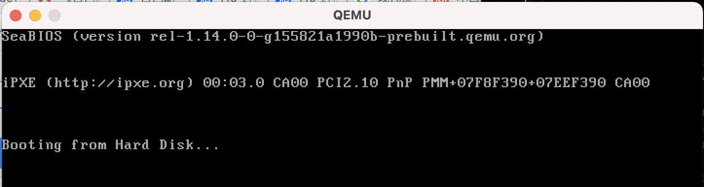
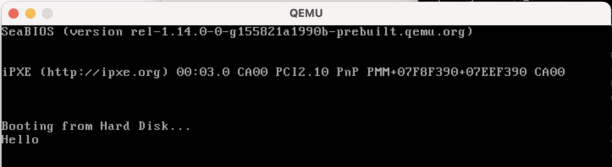

# 【读书笔记】Writing a Simple Operating System - 1

> 2021-08-20

## 背景

主要参考这本书：《Writing a Simple Operating System — from Scratch》

配合[https://github.com/ruiers/os-tutorial-cn](https://github.com/ruiers/os-tutorial-cn)食用。

最近进度：已放弃了=。=，被推荐了另一本书《Operating Systems: Three Easy Pieces》

## BIOS (Basic Input/Output Software)

在计算机启动时，会先运行BIOS。BIOS提供对计算机基本设备（如屏幕、键盘）的自动检测和控制。

在BIOS完成对硬件设备的基本测试后，需要引导存储在某个设备上的操作系统启动。

BIOS通过 **引导扇区（Boot Sector）** 来加载操作系统。**引导扇区** 位于存储设备第一个扇区，一般占用512字节。

* 为了BIOS可以更好地识别引导扇区，引导扇区的最后两个字节为0xaa55

下面是一个简单的**Boot Sector**
```
// boot_sect_simple.asm
loop:
    jmp loop

times 510-($-$$) db 0
dw 0xaa55
```
经过 **nasm** 汇编后，再用 **qemu** 执行。

```
nasm -f bin boot_sect_simple.asm -o boot_sect_simple.bin
qemu-system-x86_64 boot_sect_simple.bin
```

结果如图1所示


## 中断（Interrupts）

中断是一种机制，允许CPU暂停当前任务，并在返回当前任务之前，执行一些更高优先级的指令。

每个中断由一个唯一的数字表示

* 这个数字是中断向量（interrupt vector）的索引，整个表由 **BIOS** 初始化在内存开始处（即物理地址0x0）。
* 表中包含指向 **中断服务例程（ISR, Interrupt Service Routines）** 的地址指针。
* **ISR** 是一系列机器指令，用于处理特定的中断
* **BIOS** 通常多路复用 **ISR**


## CPU寄存器（CPU Registers）

寄存器：可用来暂存指令，数据等处理对象，可以将其看做是内存的一种。

根据种类的不同，一个CPU内部会有20~100个寄存器

在汇编语言中，可以通过 **mov** 命令对寄存器进行赋值

```
mov ax，1234  // ax是寄存器
```

寄存器分类：
1. AX (Accumulator): 主要用于存放数据
2. BX (BaseRegister): 存放访问存储器时的地址
3. CX (CountRegister): 保存计算值
4. DX (DataRegister): 数据传递，在寄存器间接寻址中的 I/O 指令中存放 I/O 端口的地址。


汇编语言中，AX、BX、CX、DX作为CPU内部的通用寄存器，用来存放参与运算的数据或是存储运算的结果。

这四个数据寄存器都是16位的，每个寄存器可以将高、低8位分别作为独立的8位寄存器使用。其中的高8位用AH、BH、CH、DH表示，低8位用AL、BL、CL、DL表示。

## Hello

一个简单的小例子：输出 **Hello**

使用的中断为 **0x10**，**0x10** 是由 BIOS 对屏幕及显示器所提供的服务程序。

中断后，AH表示要调用的功用，例子中的 **0x0e** 表示显示字符，且光标跟随字符移动。


```
mov ah, 0x0e ; 0x0e 表示打字模式
mov al, 'H'
int 0x10    ; int表示中断指令
mov al, 'e'
int 0x10
mov al, 'l'
int 0x10
mov al, 'l'
int 0x10
mov al, 'o'
int 0x10
jmp $
times 510-($-$$) db 0
dw 0xaa55
```

运行结果如图2所示

