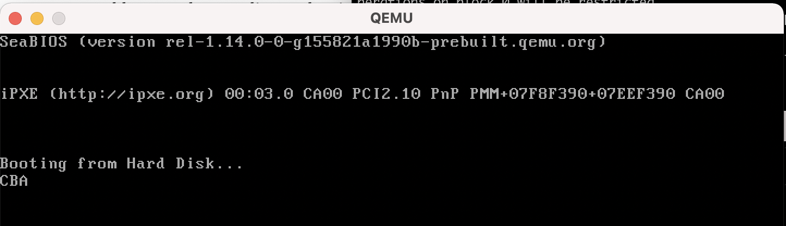

# 【读书笔记】Writing a Simple Operating System - 2

> 2021-09-01

## Stack

CPU寄存器数量有限，能存储的指令也有限。因此需要利用 Memory

CPU寄存器不关心 Memory地址，只需要存取方便。因此可以利用 Stack。

Stack由两个寄存器：**bp** 和 **sp** 表示，分别表示 base 和 top。

Stack的增长方向一般向下，远离重要的区域，例如 BIOS。

下面是一个测试case
```
mov ah, 0x0e ; 0x0e 表示打字模式

mov bp, 0x8000  ; 定义 stack base
mov sp, bp      ; 定义 stack top

push 'A'
push 'B'
push 'C'

pop bx          ; stack 里的数据必须是 16bit，即使实际数据是 8bit
mov al, bl
int 0x10

pop bx
mov al, bl
int 0x10

mov al, [0x7ffe]   ; 0x7ffe = 0x8000 - 2，这是为了测试栈的增长方向。
; 'C' 的地址为 [0x7ffa]，在pop之后，数据就会消失。
int 0x10

jmp $

times 510-($-$$) db 0
dw 0xaa55
```
经过 **nasm** 汇编后，再用 **qemu** 执行。

```
nasm -f bin test.asm -o test.bin
qemu-system-x86_64 test.bin
```

结果如图所示



## 常见的汇编指令

```
jmp target  ; 跳转

cmp ax, 4   ; 比较，后面接以下命令
je target   ; jump if equal
jne target  ; jump if not equal
jl target   ; jump if less than
jle target  ; jump if less than or equal
jg target   ; jump if greater than
jge target  ; jump if greater than or equal

call func   ; 方法调用，跳转到func入口处
ret         ; 方法返回，返回调用处

pusha       ; 将所有寄存器的内容push，使在函数调用时，不会影响原来的寄存器值
popa        ; 将所有寄存器的内容pop
```

## 打印字符串
**boot_sect_print.asm** 定义打印字符串的方法
```
print:
    pusha  ;保存所有寄存器的内容

start:
    ; 将要打印的字符移动到 al
    mov al, [bx]  ; bx存储要打印的字符串，字符串以'0'结尾
    cmp al, 0
    je done

    ; 开始打印
    mov ah, 0x0e
    int 0x10

    add bx, 1
    jmp start

done:
    popa  ;恢复所有寄存器的内容
    ret
```
**boot_sect_simple.asm** 打印具体的内容
```
[org 0x7c00]   ; 表示代码在内存偏移量，为了更好地定位tag
mov bx, HELLO_MSG
call print

jmp $

%include "boot_sect_print.asm"  ; 引入外部文件

HELLO_MSG:
    db 'Hello World!', 0;

times 510-($-$$) db 0
dw 0xaa55
```

## 段寄存器

由于寄存器大小只有 16bit，直接可以寻址的最大空间为 64KB ( 2^16 byte = 64KB )

为了扩展 memory，需要使用 **段寄存器** + **偏移量**

常用的段寄存器
1. **cs**: 代码段
2. **ds**: 数据段
3. **ss**: 栈段
4. **es**: 其他，用户自定义

段寄存器会被隐式使用，使用时，实际的地址为 **segment << 4 + address**

例如：设置 **ds** 为 **0x4d**，执行 **mov ax, [0x20]**，其实是将地址 **[0x4f0]** 的值赋值给 **ax**。

通过 **段寄存器** + **偏移量**，可以将寻址空间扩大到 1MB 左右 ( 2^16 << 4 + 2^16 byte = 17 * 64 KB = 1088 KB ~ 1MB )


