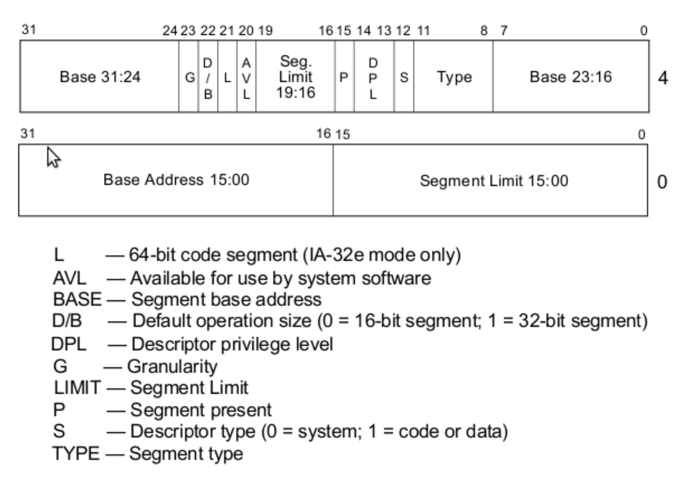

# 【读书笔记】Writing a Simple Operating System - 3

> 2021.09.05

## 从 16-bit real mode 到 32-bit protected mode

寄存器大小扩展到 32bit，对应寄存器变量新增前缀 **e**，例如 **ebx**

新增两个段寄存器 **fs**, **gs**

可寻址大小扩展到 4GB ( 2^32 byte = 4GB )

CPU支持更复杂的内存分段方式：保护段中的代码不被其他代码影响到、虚拟内存

中断处理更复杂

**32-bit protected mode** 不使用 **BIOS**

## print

显示设备分为两种模式：**text mode** 、 **graphics mode**

屏幕上显示的是，特定模式下特定内存中的视觉展示。因此我们需要操纵屏幕在当前模式下使用的内存。

计算机启动时，会从一个简单的 **视频图形阵列（Video Graphics Array, VGA）** 彩色文本模式（text mode）开始，带有 **80x25** 个字符。

在文本模式下，VGA 的内部内存中已经定义了简单字体。VGA的起始地址通常为 **0xb8000**

屏幕的每个字符由内存中的两个字节表示：第一个字节是字符的ASCII码，第二个字节编码字符属性，如前景和背景颜色以及字符是否应闪烁。

## Global Descriptor Table, GDT

**GDT**, 全局描述符表，在整个系统中，GDT只有一张，GDT可以被放在内存的任何位置，但CPU必须知道GDT的入口，也就是基地址放在哪里。寄存器GDTR用来存放GDT的入口地址，GDTR中存放的是GDT在内存中的基地址和其表长界限。

在之前介绍过，对于 **16-bit real mode**，从逻辑地址映射到物理地址的方法为

``` (value of segment register) * 16 + offset ```

对于 **32-bit protected mode**：

segment register 用于寻址 **GDT** 中的 **segment descriptor (SD)**

### SD

8 Byte，定义了以下内容：

1. **Base Address (32bit)**: 物理地址中段的开始位置
2. **Segment Limit (20bit)**: 段大小
3. **Various Flags (12bit)**: 各种标志位，会影响CPU解析段。例如涉及到只读、只写等权限。

**SD** 的结构如下图



**SD** 的 **Base** 和 **Limit** 是分散存储的，这个是约定，也可能是出于更好地分割 **SD** 里不同字段的缘故。
